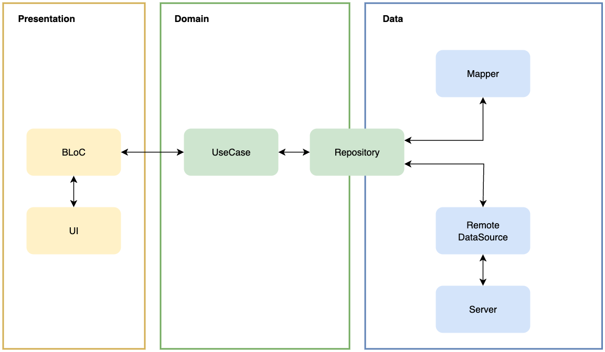

# 🎬 MoviePeek

> 실시간으로 영화 정보를 확인할 수 있는 Flutter 애플리케이션입니다.  
> Clean Architecture 구조를 적용했고, BLoC 패턴으로 상태를 관리합니다.  
> TMDB API를 사용해 인기 영화와 개봉 예정 중인 영화의 데이터를 불러옵니다.  

## 🦾 Tech Stack

- **Dart**: Flutter 앱 개발에 사용되는 공식 언어입니다.
- **BLoC**: 이벤트와 상태를 분리하여 비즈니스 로직을 관리하며, 상태 기반 UI 구현을 가능하게 합니다.
- **GoRouter**: 앱 전체의 라우팅 구조를 초기에 명시적으로 정의하는 선언형(Declarative) 라우팅을 적용합니다.
- **Clean Architecture**: 앱을 계층별로 분리하여 확장에 유연하면서도 테스트하기 쉬운 구조를 만듭니다.
  - **Domain Layer**: 앱의 핵심 비즈니스 로직을 정의합니다.
  - **Data Layer**: 서버와 같은 외부 소스로부터 데이터를 가져옵니다.
  - **Presentation Layer**: 사용자 입력을 처리하고, UI에 상태를 반영합니다.
- **GetIt**: 의존성 주입을 통해 객체 생성을 관리하고, 전역 접근을 효율적으로 처리합니다.
- **Unit Test**: 작은 규모의 비즈니스 로직을 독립적으로 테스트하여 정확성을 검증합니다.
- **Widget Test**: 개별 위젯의 UI 렌더링과 상호작용을 검증합니다.
- **Integration Test**: 실제 시나리오에서 여러 위젯과 기능이 의도에 맞게 동작하는지 확인합니다.

## 🛠️ Architecture

## ✅ Features

- **오늘의 인기 영화**
  - 실시간 인기 점수(Popularity)가 가장 높은 영화를 보여줍니다.
  - Custom Painter로 구현한 도넛 차트 페인터(DonutChartPainter)를 통해 영화의 평점을 애니메이션으로 나타냅니다. 
- **개봉 예정 영화** 
  - 개봉 예정에 있는 영화 목록을 리스트 형태로 보여줍니다.
  - 스크롤 과정에서 마지막 아이템이 보일 시, 추가 페이지를 로드하는 방식으로 페이징을 구현했습니다.
  - 커스텀 위젯인 Surface를 사용해 리스트의 각 아이템에 터치 효과를 부여합니다.
- **영화 상세 정보**
  - 선택한 영화의 상세 정보를 보여주는 화면입니다.
  - 영화 제목, 평점, 개요 정보를 한 화면에 확인할 수 있습니다.
- **다국어 지원**:
  - flutter_localizations을 사용해 두 개의 언어(English, 한국어)를 지원합니다.
  - 시스템 설정이 한국어로 되어 있을 경우 한국어 리소스를 사용하되, 그 외의 언어는 영어를 디폴트로 적용합니다.
  - TMDB API 호출 시, 시스템 설정과 동일한 언어의 영화 데이터를 불러오도록 요청을 날립니다. (단, 한국어 정보가 없는 영화의 경우는 영문 데이터를 불러옵니다.) 
- **라이트/다크 모드 지원**
  - 디스플레이 설정에 맞춰 라이트/다크 모드를 적용합니다.
  - 각 모드에 지정된 ThemeData를 사용함으로서 불필요한 팔레트 분기 로직의 사용을 최소화했습니다.
- **테스트**
  - 유틸 클래스의 리턴 값을 검증하는 Unit Test와 Custom Painter의 동작을 검증하는 Widget Test 샘플을 추가했습니다.
  - Integration Test를 통해 네비게이션 동작 및 API 응답 데이터의 UI 반영 여부를 확인할 수 있습니다.
